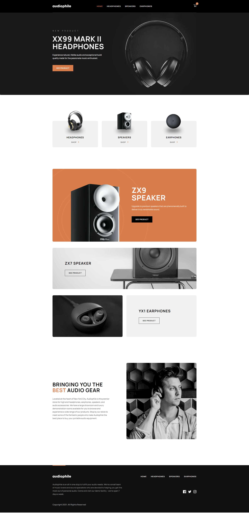

# Frontend Mentor - Audiophile e-commerce website

## Welcome! 👋
This is a solution to the [Audiophile e-commerce website challenge on Frontend Mentor](https://www.frontendmentor.io/challenges/audiophile-ecommerce-website-C8cuSd_wx). Frontend Mentor challenges help you improve your coding skills by building realistic projects. 

## Table of contents

- [Overview](#overview)
  - [The challenge](#the-challenge)
  - [Screenshot](#screenshot)
  - [Links](#links)
- [My process](#my-process)
  - [Built with](#built-with)
  - [What I learned](#what-i-learned)
  - [Useful resources](#useful-resources)
- [Author](#author)
- [Acknowledgments](#acknowledgments)

## Overview

### The challenge

Users should be able to:

- View the optimal layout for the app depending on their device's screen size
- See hover states for all interactive elements on the page
- Add/Remove products from the cart
- Edit product quantities in the cart
- Fill in all fields in the checkout
- Receive form validations if fields are missed or incorrect during checkout
- See correct checkout totals depending on the products in the cart
  - Shipping always adds $50 to the order
  - VAT is calculated as 20% of the product total, excluding shipping
- See an order confirmation modal after checking out with an order summary
- **Bonus**: Keep track of what's in the cart, even after refreshing the browser (`localStorage` could be used for this if you're not building out a full-stack app)

### Screenshot

### Links

- Solution URL: [GitHub solution](https://github.com/miroslavdurin/Audiophile)
- Live Site URL: [Audiophile](https://audiophile-mdurin.netlify.app/)

## My process

### Built with

- Semantic HTML5 markup
- CSS custom properties
- SASS/SCSS
- BEM methodology
- Flexbox
- CSS Grid
- [Axios](https://axios-http.com/docs/intro) - Promise based HTTP client for the browser and node.js
- [React](https://reactjs.org/) - JS library
- [Redux Toolkit](https://redux-toolkit.js.org) - State management system for React
- [React Router v6](https://reactrouter.com/docs/en/v6/getting-started/overview) -  Routing library for React
- [React Hook Form](https://react-hook-form.com/) - Form validation library for React
- [Framer Motion](https://www.framer.com/docs/) - Animation library for React

### What I learned

This was my first time using Redux Toolkit and React Hook Form, so I've gained some basic knowledge in these libraries. What I'm most proud of are gallery hover effects and SVG filters usage. I really like those effects and I'm glad I used it here. Everything else was more or less the same knowledge used on other projects. I've also found a way to make responsive animations in Framer Motion, which was my struggle in last couple projects.

### Useful resources

- [Stack Overflow](https://stackoverflow.com) - This helped me with some bugs, mainly with Framer Motion bugs.
- [Framer Motion docs](https://www.framer.com/docs/) - Framer Motion documentation.

## Author

- Frontend Mentor - [@miroslavdurin](https://www.frontendmentor.io/profile/miroslavdurin)
- GitHub - [@miroslavdurin](https://github.com/miroslavdurin)

## Acknowledgments

This was my biggest project so far and one that I'm most proud of. It took me a while to finish it, but I'm glad I took my time to make it just the way that I wanted.